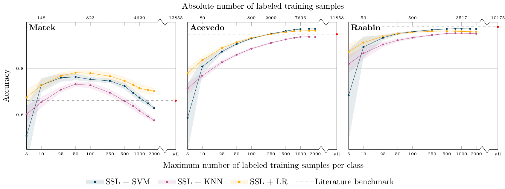

# Cell Classification

This repository ...
## Features
- Train-test splits for all datasets for future work and reproducibility

## How to use
Clone the repository to your local machine:
```bash
git clone https://github.com/IPMI-ICNS-UKE/cell-classification.git
```

Install the necessary dependencies:

## Data sets

The following data sets were used in this study:

- **Bone Marrow (BM) data set:** A highly unbalanced data set of single bone marrow cell microscopy images that can be found [here](https://wiki.cancerimagingarchive.net/pages/viewpage.action?pageId=101941770) and is provided by [Matek et al. (2021)](https://doi.org/10.1182/blood.2020010568).
- **Blood Matek data set:** 
- **Blood Acevedo data set:**
- **Blood Raabin data set:**
  
For each data set, the trained XCiT small model weights are provided and can be used in the following way:
```python
import timm
model = timm.models.xcit_small_12_p8_224_dist(in_chans=3, pretrained=True)
```

## Results
In the following, main results of the performed experiments are presented. 


*Figure 1: *
 
